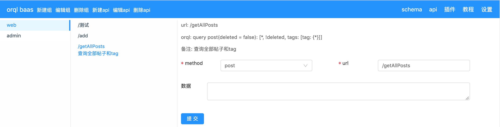

# orql baas

orql baas是基于[orql](https://github.com/orql/orql-executor)和[koa](https://github.com/koajs/koa)的可视化后端云框架,支持可视化编辑api和插件可视化配置.

## 安装

```
npm install orql-baas -g
```

## 使用

```
cd project/
orqls dev # 启动编辑环境
orqls start # 屏蔽编辑
```

访问http://localhost:3000

schema


api



api编辑

